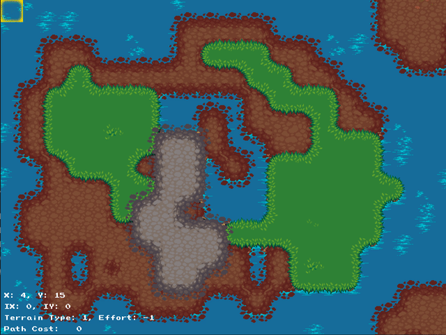

# Planning Demos in 2D

I needed a fun C++ coding project; I wanted to learn simple arcade-style graphics; and I wanted a framework to try out different path-planning algorithms.  This is the resultant WIP.

## To Build:

Dependencies (that I can think of):
- A modern C++ compiler (Supporting c++17 or newer)
- OpenGL
- X11
- CMake >= 3.1

You should be able to build with CMake as normal:
```bash
mkdir build && cd build
cmake ../ && make
```

## To Use

```build/planner-demo <input-file.yaml>```

### Input / Config Options
Static map configuration:
```yaml
---
method: A* # [A*|astar], [RRT*|rrtstar]
maptype: static  # static, procedural
dims:
  x: 5  # Number of tiles along x
  y: 3  # Number of tiles along y
map: [  # Terrain map
    0, 0, 1, 0, 0,
    0, 1, 1, 1, 0,
    0, 1, 1, 0, 0
]    
```

Procedural (run-time) map generation:
```yaml
---
method: A*
maptype: procedural
dims:
  x: 100
  y: 100
seed: 101  # Seed value for the noise algorithm used to generate the map
```

## Demo
